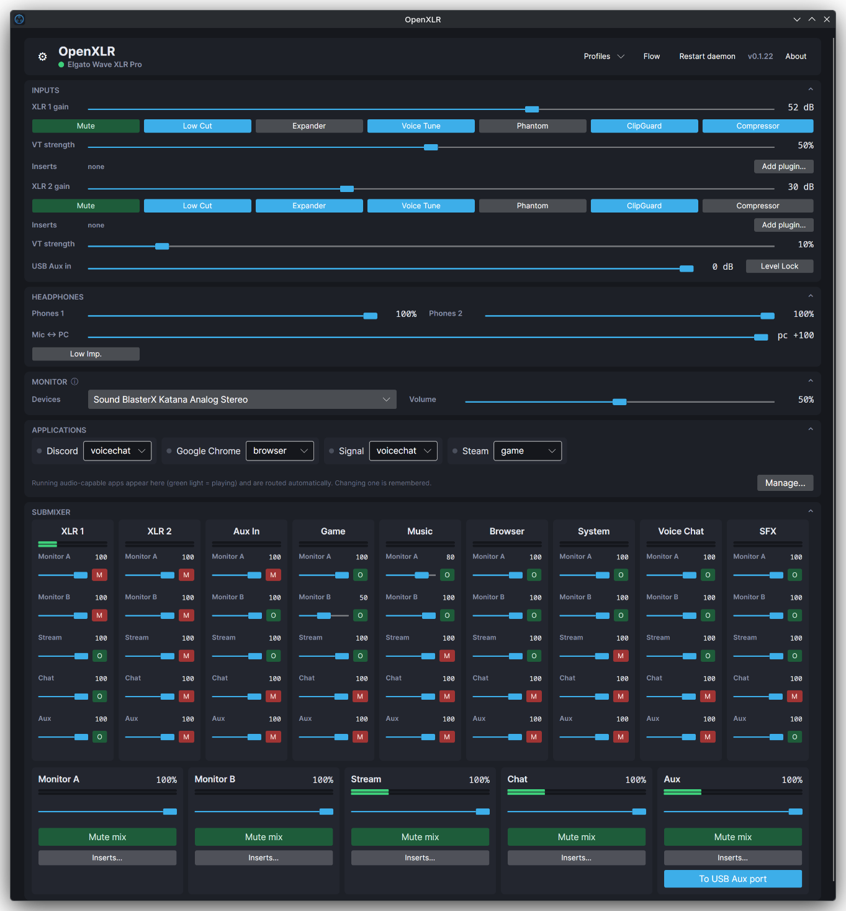

# OpenXLR

Native Linux control suite for Elgato XLR interfaces: full hardware
control over reverse-engineered USB protocols, a Wave Link style
PipeWire submixer with per-application channels, virtual microphones,
LV2 plugin inserts, multi-output monitoring, a dedicated mix for a
second computer on the USB Aux port, and an OpenDeck plugin for Stream
Deck control.



Elgato ships no Linux software. These devices enumerate as
class-compliant USB audio interfaces, so audio flows out of the box.
Gain, DSP, phantom power, output routing and the hardware mixer only
answer to vendor protocols, which this project reverse engineered from
USB captures of Wave Link and reimplemented from scratch.

Not affiliated with or endorsed by Elgato. Built by protocol analysis on
the author's own hardware.

## Supported devices

| Device | USB id | Status |
|---|---|---|
| Wave XLR Pro | 0fd9:00b4 | full support, verified on hardware |
| XLR Dock (Stream Deck+ module) | 0fd9:00a6 | gain, mute, headphone volume, 48V phantom power, low impedance; verified on hardware |
| Wave XLR | 0fd9:007d | gain, mute, headphone volume, low impedance, 48V phantom power; verified on hardware by community testers |
| Wave XLR MK.2 | 0fd9:00b6 | gain, mute, phantom power, DSP, ClipGuard, compressor, headphone volume, crossfade; verified on hardware by a community tester |
| XLR Dock MK.2 (Stream Deck+ module) | 0fd9:00c7 | same controls as the Wave XLR MK.2; every control verified on hardware |

The UI shows only the controls the connected device has, and a picker
in the header switches between several attached interfaces. The
per-control state of every device is in
[docs/hardware-support.md](docs/hardware-support.md). Own an untested
device? Open an issue with a diagnostics archive (Options, SUPPORT,
Collect diagnostics).

## Features

- **Hardware control** over the vendor USB protocol. On the Pro: gain,
  mute, low cut, expander, voice tune and phantom power per input,
  ClipGuard, compressor, aux input level and lock, two headphone
  volumes with low-impedance mode, the mic/PC crossfade, and the
  physical output routing (HP1, HP2, Line Out, USB Aux). The other
  devices expose the subset their protocol has; see the table above.
  Devices without onboard DSP get a software low cut, ClipGuard and
  gain lock in the PipeWire layer instead.
- **Submixer** built from PipeWire nodes (null sinks, remap sources,
  filter chains), no kernel modules. Hardware inputs plus user-managed
  application channels that can be added, renamed, or removed; Monitor and Aux plus any number of user-managed
  output mixes published as virtual microphones; per-send levels and
  mutes, level meters, and the monitor mix on several outputs at once.
- **Inserts**: LV2 plugin chains on each XLR input and each mix, with a
  plugin picker, generated control windows and bypass LEDs.
- **Application routing**: audio clients are detected from their
  PipeWire registration and routed to a channel by name rules, with the
  assignment remembered per app. Electron apps are identified by their
  process binary rather than the "Chromium" name they report. Routing can
  also be changed directly on the application nodes in the Flow window.
- **Profiles**: named scenes holding the hardware settings and the
  whole submix (levels, mutes, outputs, insert chains), saved per device
  and recalled from the UI, the API or a Stream Deck key. One profile
  per device can be recalled on connect, so an interface comes up in a
  known scene at login or after a power cycle.
- **OpenDeck plugin**: key and dial actions for every switch, mute,
  level and insert, rendered with level meters and status LEDs. It is a
  client of the daemon's API, so it reflects changes made in the UI or
  on the hardware. Mixer choices come from live channel and output state,
  so added, renamed and removed layout entries appear correctly.
- **Daemon and UI**: the daemon owns the device and the graph, keeps
  running with the window closed, re-asserts the chosen default sink
  and source once a second, and serves a WebSocket API on
  127.0.0.1:37890. The UI has a routing graph view, a tray icon and a
  diagnostics archive exporter.

The full feature list, area by area: [docs/features.md](docs/features.md).

### OpenDeck plugin

Dials get a touch panel with a knob, a level meter, the value and a
mute overlay; one dial can hold several targets, cycled by tap or
press.


Keys show an icon and a status LED (red for a mute, green for an
engaged feature or the active monitor output). Every hardware switch,
mute, level and insert is a target.


## Install

**Arch Linux** (AUR):

```sh
yay -S openxlr        # or: paru -S openxlr
systemctl --user enable --now openxlr-daemon
openxlr               # the mixer UI, also in your application menu
```

**Ubuntu** 24.04 or newer: download the `.deb` from the
[latest release](https://github.com/emaspa/openxlr/releases/latest), then

```sh
sudo apt install ./openxlr_*_amd64.deb
systemctl --user enable --now openxlr-daemon
openxlr
```

**Fedora** 44 or newer: download the `.rpm` from the
[latest release](https://github.com/emaspa/openxlr/releases/latest), then

```sh
sudo dnf install ./openxlr-*.x86_64.rpm
systemctl --user enable --now openxlr-daemon
openxlr
```

**NixOS**: the repo is a flake with a package and a module. The module
enables the daemon itself; after a rebuild, `openxlr` is in the
application menu.

```nix
{
  inputs.openxlr.url = "github:emaspa/openxlr";
  # in your NixOS configuration:
  imports = [ openxlr.nixosModules.default ];
  services.openxlr.enable = true;
}
```

On every distribution, replug the interface once after installing so
the udev rule applies. For the Stream Deck, install
`com.emaspa.openxlr.sdPlugin.zip` from the release with OpenDeck's
install-from-file, or copy the folder the package puts in
`/usr/share/openxlr/` into `~/.config/opendeck/plugins/`. Inserts show
whatever LV2 plugins are installed (`lsp-plugins-lv2` is the set used
during development); the software ClipGuard for the XLR Dock needs
`swh-plugins`. The NixOS module wires both up itself.

### Build from source

Needs the .NET 10 SDK, PipeWire with its CLI tools, libusb, and lilv
(package names per distribution in
[docs/install-from-source.md](docs/install-from-source.md)).

```sh
git clone https://github.com/emaspa/openxlr.git
cd openxlr/src
dotnet build -c Release
OPENXLR_BUILD_MIXER=1 ./OpenXLR.Daemon/bin/Release/net10.0/OpenXLR.Daemon   # terminal 1
./OpenXLR.UI/bin/Release/net10.0/OpenXLR.UI                                 # terminal 2
```

Device access needs the udev rule from `packaging/70-openxlr.rules`
installed under `/etc/udev/rules.d/` and a replug. The XLR Dock also
needs the WirePlumber rule from `packaging/`. Running the daemon as a
user service, updating and uninstalling:
[docs/install-from-source.md](docs/install-from-source.md).

## Documentation

- [Manual](docs/manual.md): first run, the concepts behind the mixer,
  step-by-step tasks, the Stream Deck plugin, troubleshooting
- [Features](docs/features.md): every control, the submixer, inserts,
  routing, profiles and the OpenDeck plugin in detail
- [Roadmap](docs/roadmap.md): what comes next, in order, and the rules a
  change has to meet to land
- [Installing from source](docs/install-from-source.md): prerequisites
  by distribution, device access, the user service, updating,
  uninstall, environment variables
- [WebSocket API](docs/api.md): the daemon's command set and the files
  under `~/.config/openxlr`
- [Architecture](docs/architecture.md): daemon, UI and plugin, the
  PipeWire graph, the device protocols, repository layout
- [Hardware support](docs/hardware-support.md): per-control status of
  every device
- [Wave XLR Pro protocol](docs/wave-xlr-pro-protocol.md): the vendor
  protocol as reverse engineered, with offsets
- [USB capture guide](docs/usb-capture.md): how to capture Wave Link
  traffic for an untested device

## Reporting problems

Open Options, then SUPPORT, then Collect diagnostics. It writes
`~/openxlr-diagnostics-<timestamp>.tar.gz` with the app and device
state, a raw vendor-block dump, the PipeWire graph, daemon logs and
configs. Nothing gets uploaded; attach the archive to an issue yourself.

## Credits

OpenXLR is written and maintained by Emanuele Sparvoli. It exists in its
current form because other people gave it code, hardware time and prior
work.

Code:

- [Carina Schoppe](https://github.com/CarinaSchoppe): routing and device
  control hardening, transactional graph changes, the bounded WebSocket
  send queue, diagnostics redaction, systemd sandboxing, the xUnit test
  project and the CI workflow ([#4](https://github.com/emaspa/openxlr/pull/4));
  verified stream moves ([#12](https://github.com/emaspa/openxlr/pull/12)),
  multi-batch `pw-dump` parsing ([#13](https://github.com/emaspa/openxlr/pull/13)),
  the hardened window daemon client ([#14](https://github.com/emaspa/openxlr/pull/14)),
  coalesced state broadcasts ([#15](https://github.com/emaspa/openxlr/pull/15)),
  the Restart daemon button ([#16](https://github.com/emaspa/openxlr/pull/16))
  and the API document fix ([#17](https://github.com/emaspa/openxlr/pull/17));
  the daemon watchdog ([#18](https://github.com/emaspa/openxlr/pull/18)) and
  the native LV2 plugin editors ([#19](https://github.com/emaspa/openxlr/pull/19))
  in review, split out of her larger proposal
  ([#10](https://github.com/emaspa/openxlr/pull/10)).
- [Michael Brooks](https://github.com/Michael-Brooks): the stream-sweep
  starvation fix ([#7](https://github.com/emaspa/openxlr/pull/7)) and the
  diagnosis that led to it.

Hardware testing, on devices the maintainer does not own:

- [BenjyEX3](https://github.com/BenjyEX3): Wave XLR MK.2, every control
  verified, including the block dump that placed phantom power, ClipGuard
  and the compressor ([#2](https://github.com/emaspa/openxlr/issues/2)).
- [Michael Brooks](https://github.com/Michael-Brooks) and a second owner:
  the original Wave XLR on two units
  ([#6](https://github.com/emaspa/openxlr/issues/6)).
- [chromacurse](https://github.com/chromacurse): the Wave XLR Pro
  headphone-mix report and the two diagnostics archives that let the
  hardware mix membership be decoded
  ([#8](https://github.com/emaspa/openxlr/issues/8)).
- [Astros52](https://github.com/Astros52): the XLR Dock MK.2 descriptor
  dump that got the device registered before one was on hand
  ([#1](https://github.com/emaspa/openxlr/issues/1)).
- The CachyOS tester whose first-run failure found the missing ASP.NET
  runtime dependency in the AUR package.

Prior work OpenXLR builds on:

- [openwave](https://github.com/rikkichy/openwave) by rikkichy: the
  original Wave XLR's class protocol, and the phantom-power byte found in
  [openwave PR #8](https://github.com/rikkichy/openwave/pull/8), which the
  XLR Dock turned out to share.
- [OpenDeck](https://github.com/nekename/OpenDeck) by nekename: the
  Stream Deck host the plugin runs in, including the touch-tap support
  merged upstream for the Stream Deck + XL.
- [FrostyCoolSlug](https://github.com/FrostyCoolSlug), author of
  [goxlr-utility](https://github.com/GoXLR-on-Linux/goxlr-utility) and
  [PipeWeaver](https://github.com/FrostyCoolSlug/pipeweaver), for
  suggesting ALSA UCM for the Pro's channel split.

## Status

Developed and used daily by the author with a Wave XLR Pro, an XLR
Dock, an XLR Dock MK.2 and a Stream Deck + XL. The Wave XLR and Wave
XLR MK.2 backends were verified on hardware by community testers. See
the device table and docs/hardware-support.md for what is still open.

The majority of the code was produced by the author, with AI tooling
(Anthropic's Claude) assisting with protocol capture analysis, UI design
and parts of the coding. Every hardware finding was verified live on a
real device.

## License

[GPL-3.0](LICENSE). If you find OpenXLR useful, consider
[buying me a coffee](https://buymeacoffee.com/emaspa).
