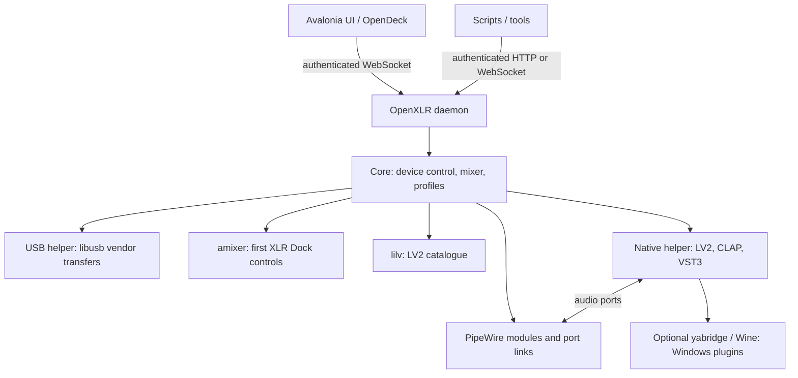

# Architecture



- `OpenXLR.Daemon` owns the device and graph. It polls hardware, maintains
  the mixer, routes application streams and broadcasts state to clients.
  The WebSocket endpoints and HTTP API share one dispatcher on
  `127.0.0.1:37890`. Clients authenticate with a private per-run token;
  browser Origins, command sizes and rates are checked as well.
- `OpenXLR.UI` is an Avalonia client with no Core assembly dependency. It
  parses state and sends commands. It also manages local window preferences,
  autostart and the daemon service, collects diagnostics, and optionally
  checks GitHub releases. Closing it leaves audio running. Its Flow window
  builds a four-column view from state; selecting a path changes only
  the visualization.
- The OpenDeck plugin is an OpenAction plugin in OpenDeck's Node runtime,
  using the same authenticated API and live choices as the window.
- `OpenXLR.Core` contains device backends, the PipeWire adapter, mixer,
  application matching, plugin catalogues and profile storage. The native
  host processes plugin audio without passing samples through managed code.

Configuration lives in `$XDG_CONFIG_HOME/openxlr` (default `~/.config/openxlr`).
The token and instance lock live in `$XDG_RUNTIME_DIR/openxlr`, falling back
to the configuration directory when unavailable. See [api.md](api.md) for
file names and [http-api.md](http-api.md) for transport limits.

## The PipeWire graph

Everything is built with standard PipeWire modules and tools, no kernel
modules or custom drivers:

- One null sink per mix (`pactl load-module module-null-sink`): the
  two monitor mixes, one per virtual microphone, and Aux.
- One combine sink per channel (`module-combine-sink`) whose internal
  streams, one per mix, are the send faders: setting a send is setting
  that stream's volume. Applications play into these sinks. The combine
  names its targets by pattern (`slaves=~OpenXLR_mix_`), and PipeWire's
  combine keeps watching the registry, so a mix sink created later gets
  its own stream in every combine and a removed one loses them without
  any channel being reloaded. The default layout's 9 channels and 5
  mixes are 14 sinks and no loopback processes.
- For every virtual-microphone mix, a post sink fed from the mix
  (directly or through the mix's insert chain) and a remap source
  (`module-remap-source`) reading its monitor: the virtual microphone an
  application records from. The indirection means adding inserts later
  never recreates the device the application is recording.
- The layout is edited live (`docs/mixer-layout.md`): a channel or mix
  is added by loading its own nodes, removed by unloading them, and a
  channel is renamed by reloading its sink and moving its streams back.
  A virtual microphone is never reloaded for a rename, since a recorder
  does not come back to a reloaded device; its description follows at
  the next daemon start. Every edit is written to `mixer.json` before it
  is acknowledged.
- pipewire-pulse hosts all of these modules and inherits systemd's
  default limit of 1024 open files; every combine stream and meter costs
  it a few. The daemon refuses an addition without headroom and the
  packages install a drop-in raising the limit. When pipewire-pulse
  restarts it takes every module with it and reuses their ids, so the
  daemon forgets the graph without unloading anything and exits with
  code 75 for systemd to start it afresh.
- Filter chains (the software low cut and ClipGuard, and LV2
  inserts left on the default backend) are `filter-chain` nodes, each held by a
  long-lived `pw-cli -m` process for the life of the chain; their
  controls are set with `pw-cli set-param`.
- A native insert runs in an `openxlr-lv2-host` process with a PipeWire
  filter node. LV2 chooses this per insert; CLAP and VST3 always use it.
  Stages can mix native and filter-chain backends, linked in signal order.
  The command pipe carries parameter values, status and editor requests,
  never audio. Exposed parameters are persisted; opaque plugin state and
  presets are not. See [native/README.md](../native/README.md) for editor
  recovery, size constraints and LSP renderer defaults.
- Direct port links (`pw-link`) wire hardware inputs, chains, mixes and
  outputs, so the output device clocks the chain. Hardware inputs are
  wired by capture-channel pair (XLR 1 = pair 0, XLR 2 = pair 1, Line
  In/USB Aux = pair 2); the Aux mix feeds the device's aux return pair
  so the hardware forwards it to the USB Aux port.
- `pw-dump` reads the graph, once per sweep and parsed straight from
  its bytes; `wpctl` sets card profiles (parking the Pro on pro-audio)
  and node volumes, and `parec` on the sinks' monitors feeds the level
  meters. Helpers run in the C locale, since `pactl`'s output is parsed
  and localised.
- Sink and source properties reach `pactl` as one double-quoted list
  with descriptions single-quoted inside (PipeWire's module parser
  splits the argument on whitespace, then parses the list). Application
  channels and the virtual microphones carry `node.virtual=false` so
  desktop applets list them; hardware input channels keep the flag and
  stay hidden.

## Plugin discovery and Windows bridging

LV2 metadata is read through lilv. CLAP and VST3 bundles are described in
isolated helper processes, with bounded output and a cache invalidated by
bundle changes. An optional managed bridge also keys that cache by its
package version, source commit and installation directory.

`ManagedYabridge` selects a complete companion installation, or falls back
to the system/user bridge. It prepends the companion to PATH only for the
scanner, host and controller it starts. Plugin processes retain HOME,
WINEPREFIX and their settings environment. The controller alone receives
a private configuration root and wrapper destination. Private wrappers
are searched first and deduplicated by plugin id.

The companion supplies 64-bit yabridge; Wine remains external. Its pinned
source, package formats and separate artifact workflow are documented in
[packaging/yabridge](../packaging/yabridge/README.md).

## Application identity

Playback-node metadata takes precedence, with missing application and
process fields filled from the owning PipeWire client. Electron process
names and Wine/Proton executable names are normalized before looking up
routing rules and saved overrides. On loading legacy aliases, an existing
canonical override wins. Assigning or forgetting an app uses the same key.
Pre-assignments from desktop launchers remain best-effort when the running
application reports a different identity.

## The device protocols

The five devices use vendor-block and class-request protocols plus ALSA
controls, all reached without detaching the kernel's audio driver:

- Wave XLR Pro, Wave XLR MK.2 and XLR Dock MK.2: a vendor block bank
  on the unclaimed interface (`bmRequestType 0x41/0xC1`, `bRequest 1`,
  `wIndex 0x0103` on the Pro and the XLR Dock MK.2, `0x0203` on the
  Wave XLR MK.2). Fixed-size
  blocks hold gain, packed flag bits, and on the Pro the hardware mix
  matrix; a write reads the block, modifies it, writes it back, and on
  the Pro follows with a commit block. Offsets and how they were found:
  [wave-xlr-pro-protocol.md](wave-xlr-pro-protocol.md)
- Wave XLR (MK.1) and XLR Dock: a class-request protocol
  (`bRequest 0x85/0x05`, `wIndex 0x3303`) with one config block, as
  documented by the openwave project. The dock answers it too, which is
  how it gained phantom power (config byte 6) and low impedance (byte
  33); its everyday controls (gain, mute, headphone volume) go through
  the kernel's standard ALSA controls with `amixer`, and its DSP is
  provided host-side by the submixer

libusb never runs inside the daemon: a helper process (the daemon
binary started with `--usb-helper`) owns it and answers open, close and
control-transfer requests over length-prefixed frames on its stdin and
stdout. Every transfer runs under a watchdog (the libusb timeout plus
3 s); one that never returns is reported, the helper is killed so the
operating system reclaims the stuck thread and the device handle, the
device is dropped and reconnected through a fresh helper, and the
daemon keeps serving. After three hangs of one device without a replug
the daemon sets it aside instead of retrying. A helper whose device
could not be opened at all (no permission yet, a busy interface) is
killed at once, and the next attempt waits two seconds, so a device the
udev rule has not reached yet never turns into a stream of helper
processes.

## Repository layout

```
src/            .NET solution: Core (device + mixer), Daemon, UI, Probe, Tests
native/         optional C/C++ plugin host, vendored interface headers, editor tests
plugin/         the OpenDeck (Stream Deck) plugin
docs/           this documentation, protocol write-up, capture guides
tools/          proprobe.py, a standalone Python probe for the vendor protocol,
                and the CI checks (versions, locked restores, the OpenAPI
                document's shape, the rpm recipe's %files)
packaging/      systemd unit, the pipewire-pulse open-file drop-in, udev rule,
                WirePlumber rules, UCM profile, rpm and nix packaging, OpenDeck patches,
                optional yabridge companion source and package recipes
debian/         Debian/Ubuntu packaging
```
